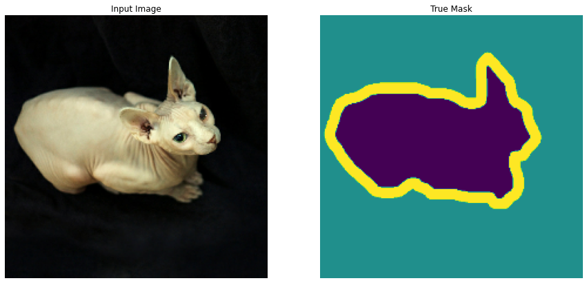
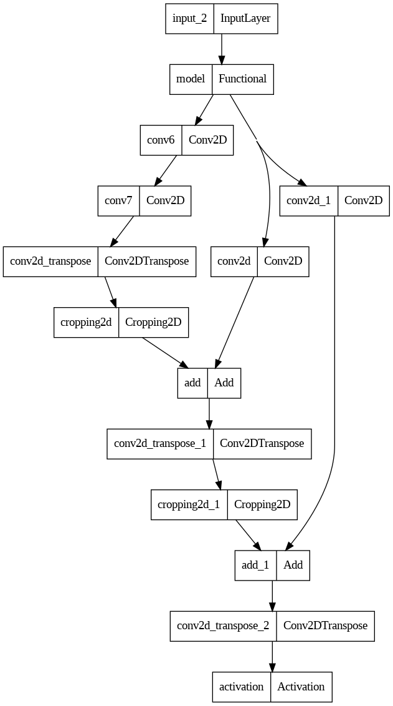
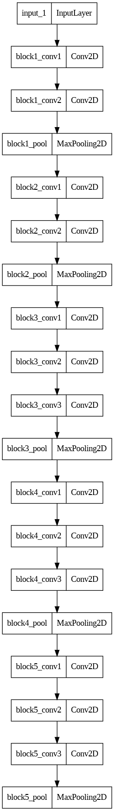
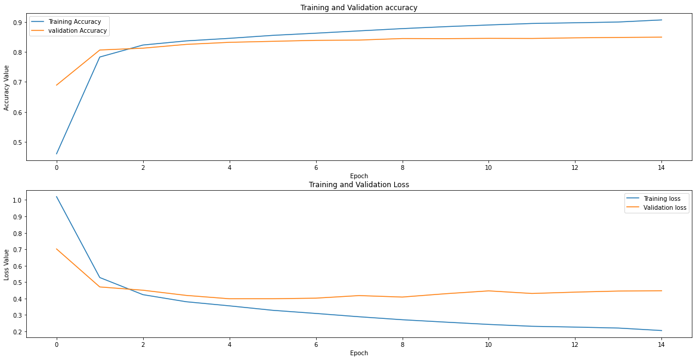

<div style="position: absolute; top: 0; right: 0;">
    <a href="ertugrulbusiness@gmail.com"></a>
    <a href="https://tr.linkedin.com/in/ertu%C4%9Fruldemir?original_referer=https%3A%2F%2Fwww.google.com%2F"></a>
    <a href="https://github.com/ertugruldmr"></a>
    <a href="https://www.kaggle.com/erturuldemir"></a>
    <a href="https://huggingface.co/ErtugrulDemir"></a>
    <a href="https://stackoverflow.com/users/21569249/ertu%c4%9frul-demir?tab=profile"></a>
    <a href="https://medium.com/@ertugrulbusiness"></a>
    <a href="https://www.youtube.com/channel/UCB0_UTu-zbIsoRBHgpsrlsA"></a>
</div>

# Pet Image Segmentation
 
## __Table Of Content__
- (A) [__Brief__](#brief)
  - [__Project__](#project)
  - [__Data__](#data)
  - [__Demo__](#demo) -> [Live Demo]()
  - [__Study__](#problemgoal-and-solving-approach) -> [Colab]()
  - [__Results__](#results)
- (B) [__Detailed__](#Details)
  - [__Abstract__](#abstract)
  - [__Explanation of the study__](#explanation-of-the-study)
    - [__(A) Dependencies__](#a-dependencies)
    - [__(B) Dataset__](#b-dataset)
    - [__(C) Modelling__](#e-modelling)
    - [__(D) Deployment as web demo app__](#g-deployment-as-web-demo-app)
  - [__Licance__](#license)
  - [__Connection Links__](#connection-links)
  - NOTE: The model file exceeded limitations. you can download it from this [link]().

## __Brief__ 

### __Project__ 
- This is an __image seggmentation__ (a subtask of classification) project as image __segmentation task__ that uses the  [__oxford_iiit_pet__](https://www.tensorflow.org/datasets/catalog/oxford_iiit_pet) to __classify the pixel__ whether a piece of an object or not, so this is called segmentation.
- The __goal__ is build a deep learning image classification model that accurately __segments the pets__ from images.
- The performance of the model is evaluated using several __metrics__ loss and accuracy metrics.

#### __Overview__
- This project involves building a deep learning model to segments the pets from images. The dataset contains 3669 images about cats and dogs.  The models selected according to model tuning results, the progress optimized respectively the previous tune results. The project uses Python and several popular libraries such as Pandas, NumPy, tensorflow.

#### __Demo__

<div align="left">
  <table>
    <tr>
    <td>
        <a target="_blank" href="" height="30">[Demo app] HF Space</a>
      </td>
      <td>
        <a target="_blank" href="">[Demo app] Run in Colab</a>
      </td>
      <td>
        <a target="_blank" href="">[Traning pipeline] source on GitHub</a>
      </td>
    <td>
        <a target="_blank" href="">[Traning pipeline] Run in Colab</a>
      </td>
    </tr>
  </table>
</div>


- Description
    -  __segments the pets__ from images.
    - __Usage__: Set the feature values through sliding the radio buttons then use the button to predict.
- Embedded [Demo]() window from HuggingFace Space
    

<iframe
	src=""
	frameborder="0"
	width="850"
	height="450"
></iframe>

#### __Data__
- The [__oxford_iiit_pet__](https://www.tensorflow.org/datasets/catalog/oxford_iiit_pet) from tensorflow dataset api.
- The dataset contains 3669 images about cats and dogs.
- The dataset contains the following features:
  - Dataset Info
    ```raw
      tfds.core.DatasetInfo(
        name='oxford_iiit_pet',
        full_name='oxford_iiit_pet/3.2.0',
        description="""
        The Oxford-IIIT pet dataset is a 37 category pet image dataset with roughly 200
        images for each class. The images have large variations in scale, pose and
        lighting. All images have an associated ground truth annotation of breed.
        """,
        homepage='http://www.robots.ox.ac.uk/~vgg/data/pets/',
        data_path='/root/tensorflow_datasets/oxford_iiit_pet/3.2.0',
        file_format=tfrecord,
        download_size=773.52 MiB,
        dataset_size=774.69 MiB,
        features=FeaturesDict({
            'file_name': Text(shape=(), dtype=string),
            'image': Image(shape=(None, None, 3), dtype=uint8),
            'label': ClassLabel(shape=(), dtype=int64, num_classes=37),
            'segmentation_mask': Image(shape=(None, None, 1), dtype=uint8),
            'species': ClassLabel(shape=(), dtype=int64, num_classes=2),
        }),
        supervised_keys=('image', 'label'),
        disable_shuffling=False,
        splits={
            'test': <SplitInfo num_examples=3669, num_shards=4>,
            'train': <SplitInfo num_examples=3680, num_shards=4>,
        },
        citation="""@InProceedings{parkhi12a,
          author       = "Parkhi, O. M. and Vedaldi, A. and Zisserman, A. and Jawahar, C.~V.",
          title        = "Cats and Dogs",
          booktitle    = "IEEE Conference on Computer Vision and Pattern Recognition",
          year         = "2012",
        }""",
    )
    ```
  - Example Dataset
      <div style="text-align: center;">
        
      </div>


#### Problem, Goal and Solving approach
- This is an __image seggmentation__ problem  that uses the  [__oxford_iiit_pet__](https://www.tensorflow.org/datasets/catalog/oxford_iiit_pet)  to __segments pets__ from images.
- The __goal__ is build a deep learning image classification model that accurately __segments the pets__ from images.
- __Solving approach__ is that using the supervised deep learning models. Fine tuning approach implemented on VGG16 state of art model for segmentating the pets. 

#### Study
The project aimed segmentating the pets using deep learning model architecture. The study includes following chapters.
- __(A) Dependencies__: Installations and imports of the libraries.
- __(B) Dataset__: Downloading and loading the dataset. Preparing the dataset via tensorflow dataset api. Configurating the dataset performance and related pre-processes. 
- __(C) Preprocessing__: Type casting, value range scaling, resizing, configurating the dataset object, batching, performance setting, visualizating, Implementing augmentation methods on train dataset and image classification related processes.
- __(D) Modelling__:
  - Model Architecture
    - Setting the base model as VGG16 but some parths of the model has been changed via fine tuning.
    - Added fcn8_decoder on haed of the model.
  - Training
    - Callbakcs and trainin params are setted. some of the callbacks are EarlyStopping, ModelCheckpoint, Tensorboard etc....  
    - Some layer of the VGG16 has been used to get output for connecting with decoder.  
  - Saving the model
    - Saved the model as tensorflow saved model format.
- __(E) Deployment as web demo app__: Creating Gradio Web app to Demostrate the project.Then Serving the demo via huggingface as live.

#### results
- The final model is __Custom Classifier Network__ because of the results and less complexity.
  -  Fine-Tuned VGG16 and f8cn_encoder Results
        <table><tr><th>Classification Results </th><th></th></tr><tr><td>
    | model                         | loss   | accuracy |
    |-------------------------------|--------|----------|
    | [val] Fine-Tuned VGG16 and f8cn_encoder  | 0.4474 | 0.8488 |
    </td></tr></table>

## Details

### Abstract
- [__oxford_iiit_pet__](https://www.tensorflow.org/datasets/catalog/oxford_iiit_pet) is used to segment the pet images.  The dataset contains 3669 images about cats and dogs. The problem is a supervised learning task as segmentation (a subtask of classification). The goal is segmenting the pet images using through supervised custom deep learning algorithms or related training approachs of pretrained state of art models .The study includes creating the environment, getting the data, preprocessing the data, exploring the data, agumenting the data, modelling the data, saving the results, deployment as demo app. Training phase of the models implemented through tensorflow callbacks. After the custom model traininigs, transfer learning and fine tuning approaches are implemented. Selected the basic and more succesful when comparet between other models  is  fine-tuned VGG16 segmentation model.__Fine-Tuned VGG16 and f8cn_encoder__ model has __0.4474__ loss , __0.8488__ acc,  other metrics are also found the results section. Created a demo at the demo app section and served on huggingface space.  


### File Structures

- File Structure Tree
```bash
├── demo_app
│   ├── app.py
│   ├── fine_tned_VGG16.h5
│   ├── requirements.txt
│   └── sample_images
│       └── images
├── docs
│   └── images
├── env
│   ├── env_installation.md
│   └── requirements.txt
├── readme.md
└── study.ipynb

```
- Description of the files
  - demo_app/
    - Includes the demo web app files, it has the all the requirements in the folder so it can serve on anywhere.
  - demo_app/fine_tned_VGG16.h5:
    - Fine tuned VGG16 model with f8cn encoder.
  - demo_app/sample_images
    - Example cases to test the model.
  - demo_app/requirements.txt
    - It includes the dependencies of the demo_app.
  - docs/
    - Includes the documents about results and presentations
  - env/
    - It includes the training environmet related files. these are required when you run the study.ipynb file.
  - LICENSE.txt
    - It is the pure apache 2.0 licence. It isn't edited.
  - readme.md
    - It includes all the explanations about the project
  - study.ipynb
    - It is all the studies about solving the problem which reason of the dataset existance.    

### Explanation of the Study
#### __(A) Dependencies__:
  - The libraries which already installed on the environment are enough. You can create an environment via env/requirements.txt. Create a virtual environment then use hte following code. It is enough to satisfy the requirements for runing the study.ipynb which training pipeline.
  - Dataset can download from tensoflow.
#### __(B) Dataset__: 
  - Downloading the [__oxford_iiit_pet__](https://www.tensorflow.org/datasets/catalog/oxford_iiit_pet)  via tensorflow dataset api. 
  - The dataset contains 3669 images about cats and dogs.
  - Preparing the dataset via resizing, scaling into 0-1 value range, implementing data augmentation and etc image preprocessing processes. 
  - Creating the tensorflow dataset object then configurating.
  - Dataset Info
  ```raw
    tfds.core.DatasetInfo(
      name='oxford_iiit_pet',
      full_name='oxford_iiit_pet/3.2.0',
      description="""
      The Oxford-IIIT pet dataset is a 37 category pet image dataset with roughly 200
      images for each class. The images have large variations in scale, pose and
      lighting. All images have an associated ground truth annotation of breed.
      """,
      homepage='http://www.robots.ox.ac.uk/~vgg/data/pets/',
      data_path='/root/tensorflow_datasets/oxford_iiit_pet/3.2.0',
      file_format=tfrecord,
      download_size=773.52 MiB,
      dataset_size=774.69 MiB,
      features=FeaturesDict({
          'file_name': Text(shape=(), dtype=string),
          'image': Image(shape=(None, None, 3), dtype=uint8),
          'label': ClassLabel(shape=(), dtype=int64, num_classes=37),
          'segmentation_mask': Image(shape=(None, None, 1), dtype=uint8),
          'species': ClassLabel(shape=(), dtype=int64, num_classes=2),
      }),
      supervised_keys=('image', 'label'),
      disable_shuffling=False,
      splits={
          'test': <SplitInfo num_examples=3669, num_shards=4>,
          'train': <SplitInfo num_examples=3680, num_shards=4>,
      },
      citation="""@InProceedings{parkhi12a,
        author       = "Parkhi, O. M. and Vedaldi, A. and Zisserman, A. and Jawahar, C.~V.",
        title        = "Cats and Dogs",
        booktitle    = "IEEE Conference on Computer Vision and Pattern Recognition",
        year         = "2012",
      }""",
  )
  ```
  - Example Dataset
      <div style="text-align: center;">
        
      </div>
#### __(C) Modelling__: 
  - The processes are below:
    - Archirecture
      - Fine-Tuned VGG16 with f8cn encoder
        - Segmentator Architecture
          <div style="text-align: center;">
            
          </div>
        - Base Model (VGG16) of the segmentator arhitecture 
          <div style="text-align: center;">
            
          </div>
    - Training
        <div style="text-align: center;">
          
        </div>
    - Evaluating and classification results
      -  Fine-Tuned VGG16 and f8cn_encoder Results
            <table><tr><th>Classification Results </th><th></th></tr><tr><td>
        | model                         | loss   | accuracy |
        |-------------------------------|--------|----------|
        | [val] Fine-Tuned VGG16 and f8cn_encoder  | 0.4474 | 0.8488 |
        </td></tr></table>
  - Saving the project and demo studies.
    - trained model __fine_tuned_VGG16.h5__ as tensorflow (keras) saved_model format.

#### __(D) Deployment as web demo app__: 
  - Creating Gradio Web app to Demostrate the project.Then Serving the demo via huggingface as live.
  - Desciption
    - Project goal is segmentating the pets from images.
    - Usage: upload or select the image for classfying then use the button to predict.
  - Demo
    - The demo app in the demo_app folder as an individual project. All the requirements and dependencies are in there. You can run it anywhere if you install the requirements.txt.
    - You can find the live demo as huggingface space in this [demo link]() as full web page or you can also us the [embedded demo widget](#demo)  in this document.  
    
## License
- This project is licensed under the Apache 2.0 License. See the [LICENSE](LICENSE) file for details.

<h1 style="text-align: center;">Connection Links</h1>

<div style="text-align: center;">
    <a href="ertugrulbusiness@gmail.com"></a>
    <a href="https://tr.linkedin.com/in/ertu%C4%9Fruldemir?original_referer=https%3A%2F%2Fwww.google.com%2F"></a>
    <a href="https://github.com/ertugruldmr"></a>
    <a href="https://www.kaggle.com/erturuldemir"></a>
    <a href="https://huggingface.co/ErtugrulDemir"></a>
    <a href="https://stackoverflow.com/users/21569249/ertu%c4%9frul-demir?tab=profile"></a>
    <a href="https://www.hackerrank.com/ertugrulbusiness"></a>
    <a href="https://app.patika.dev/ertugruldmr"></a>
    <a href="https://medium.com/@ertugrulbusiness"></a>
    <a href="https://www.youtube.com/channel/UCB0_UTu-zbIsoRBHgpsrlsA"></a>
</div>

